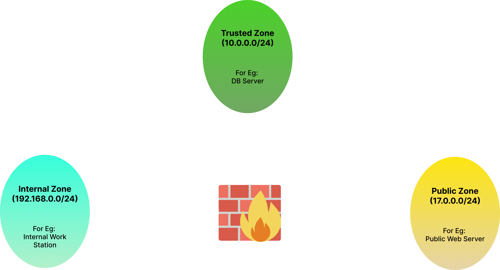

# Firewalld 
Firewall Setup and Configuration Features:  Install and set up firewalld using nftables on a linux virtual machine. Use trusted-zone, internal-zone, and public-zone.

## Setting up Firewalld on a Linux Virtual Machine

Firewalld is a firewall management tool available on various Linux distributions that provides an easy-to-use interface for configuring and managing network security rules. This README guide will walk you through the process of installing and setting up Firewalld on a Linux virtual machine. By following these steps, you'll be able to secure your VM and protect it from unauthorized access.

## Prerequisites

Before proceeding with the installation, make sure you have the following:

- A Linux virtual machine (e.g., Ubuntu, CentOS, Fedora, RHEL, or any other compatible distribution).
- Administrative access (root or sudo) to the virtual machine.

## Installation

Firewalld should be pre-installed on many modern Linux distributions. However, to ensure you have it installed or to update to the latest version, follow these steps:

1. *Check if Firewalld is installed:*

   Open a terminal on your Linux VM and execute the following command:

   ```bash
   sudo firewall-cmd --version
If Firewlld is installed, you'll see the version number. Otherwise proceed with the installation as follows:
1. *Install Firewalld*
   ```bash
   sudo intall firewalld
   ```
2. *Start and enable the Firewalld service*
   ```bash
   sudo systemctl start firewalld
   sudo systemctl enable firewalld
   ```

## Note
Use the following command to switch to the root user and access the root directory:

```bash
sudo su -
```

## Basic Usage
- Check the status of Firewalld
   ```bash
   sudo firewall-cmd --state
   ```
- Reload Firewalld rules
   ```bash
   sudo firewall-cmd --reload
   ```
- View available zones
   ```bash
   sudo firewall-cmd --get-zones
   ```
- Set the default zone:
   ```bash
   sudo firewall-cmd --set-default-zone=public
   ```
- Add a serviece to a zone
   ```bash
   sudo firewall-cmd --zone=public --add-service=http --permanent
   ```
- Open a specific port
   ```bash
   sudo firewall-cmd --zone=public --add-port=22/tcp --permanent
   ```
- Remove a service or port from a zone
   ```bash
   sudo firewall-cmd --zone=public --remove-service=http --permanent
   ``` 

## Network Firewall Configuration using Firewalld

This document provides step-by-step instructions to configure the firewall using firewalld for the given sample network topology.

## Network Topology





## Configuration Steps

### Step 1: Create Zones


- Create custom_trusted Zone with source IP range 10.0.0.0/24
 ```bash
sudo firewall-cmd --permanent --new-zone=custom_trusted
sudo firewall-cmd --permanent --zone=custom_trusted --set-source=10.0.0.0/24
```
- Create custom_internal Zone with source IP range 192.168.0.0/24
```bash
sudo firewall-cmd --permanent --new-zone=custom_internal
sudo firewall-cmd --permanent --zone=custom_internal --set-source=192.168.0.0/24
```

- Create custom_public Zone for public IP range 17.0.0.0/24
```bash
sudo firewall-cmd --permanent --new-zone=custom_public
sudo firewall-cmd --permanent --zone=custom_internal --set-source=17.0.0.0/24
```
### Step 2: Assign interfaces to corresponding zones
```bash
sudo firewall-cmd --permanent --zone=custom_trusted --add-interface=eth0

sudo firewall-cmd --permanent --zone=custom_internal --add-interface=eth1
```
### Step 3: Define services

- Define services for each zone
```bash
sudo firewall-cmd --permanent --zone=custom_trusted --add-service=ssh

sudo firewall-cmd --permanent --zone=custom_internal --add-service=ssh
sudo firewall-cmd --permanent --zone=custom_internal --add-service=http

sudo firewall-cmd --permanent --zone=custom_public --add-service=http
sudo firewall-cmd --permanent --zone=custom_public --add-service=ssh
```

### Step 4: Define source ports for each zone
```bash
sudo firewall-cmd --permanent --zone=custom_internal --add-source-port=1024-65535/tcp
sudo firewall-cmd --permanent --zone=custom_internal --add-source-port=1024-65535/udp

sudo firewall-cmd --permanent --zone=custom_public --add-source-port=1024-65535/tcp
sudo firewall-cmd --permanent --zone=custom_public --add-source-port=1024-65535/udp
```
### Step 5: Allow Forwarding from custom_trusted to custom_internal

- Let us assume a DB server whose IP address is 192.168.0.10 and a sample App server whose IP address is 192.168.0.20
  
```bash
sudo firewall-cmd --permanent --zone=custom_trusted --add-forward-port=port=22:proto=tcp:toport=22:toaddr=192.168.0.10
sudo firewall-cmd --permanent --zone=custom_trusted --add-forward-port=port=80:proto=tcp:toport=80:toaddr=192.168.0.20
```
### Step 6: Set Target
```bash
sudo firewall-cmd --permanent --zone=custom_trusted --set-target=ACCEPT
sudo firewall-cmd --permanent --zone=custom_internal --set-target=ACCEPT
sudo firewall-cmd --permanent --zone=custom_public --set-target=ACCEPT
```
### Step 7: Reload firewall 
```bash
sudo firewall-cmd --reload
```

### Step 8: Fetch all details

- Fetching all the details of custom_public zone.
  
```bash
sudo firewall-cmd --zone=custom_public --list-all
```


- Fetching all the details of custom_internal zone
  
```bash
sudo firewall-cmd --zone=custom_internal --list-all
```


- Fetching all the details of custom_trusted zone
  
```bash
sudo firewall-cmd --zone=custom_trusted --list-all
```


   

   
